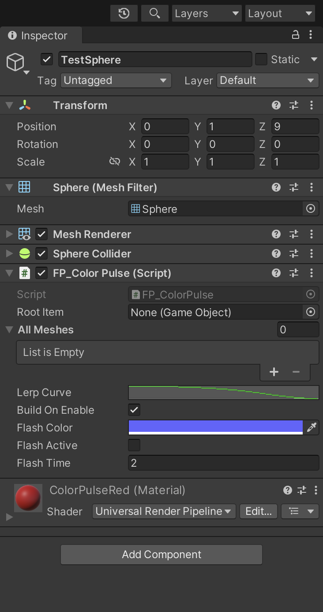

# What is this?

This is just a quick Unity thing to help the internet. It's main function is to recursively loop over each child transform looking for a mesh renderer - if it finds a mesh renderer it will then parse that mesh renderer of it's current materials and emission colors and store them to a dictionary. Then whenever you want to make the material glow via a sort of faked 'pulse' you just call 'ActivatePulse'.

## Script File

I have also attached [just the C# script](https://github.com/JShull/FPulse/blob/main/FP_ColorPulse.cs) to this repository as well - as it's not dependent upon anything else.

## Unity Package, Dependencies, & How to.

[YouTube showing it working](https://youtu.be/jQzFr8ui-gI)

Created the [package](https://github.com/JShull/FPulse/blob/main/PulseExample.unitypackage) in Unity 2022.1.13f1 I do have some URP stuff in here but none of that is needed - you really only need the script and you need to throw it on your parent item that you want to grab all of the children and their meshrenderer's. Pick a pulse color and make sure you have some time set in there.

**Dependencies in Package**

>"com.unity.postprocessing": "3.2.2",
>
>"com.unity.render-pipelines.universal": "13.1.8",

## Why?

This was done in about 15 minutes and was primarily done to help a random reddit request I came across. I started a new LLC and I'm not sure what I'm going to be doing with it yet... maybe some Unity work for hire, maybe just open source everything I make, who knows, but I doubt I actually come back to this repository and make any serious adjustments... or maybe I will... :smile:

### License

MIT: Do whatever you want - if you're feeling extra awesome throw me a follow on Twitter or just say hi! :rocket: [TheJohnnyFuzz](https://twitter.com/TheJohnnyFuzz)
